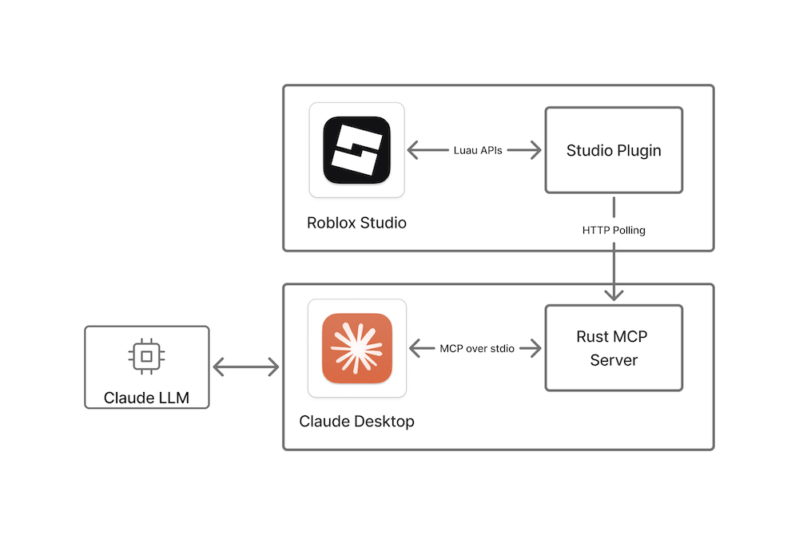

# Roblox Studio MCP Server

This repository contains a reference implementation of the Model Context Protocol (MCP) that enables
communication between Roblox Studio via a plugin and [Claude Desktop](https://claude.ai/download).
It consists of the following Rust-based components, which communicate through internal shared
objects.

- A web server built on `axum` that a Studio plugin long polls.
- A `rmcp` server that talks to Claude via `stdio` transport.

When LLM requests to run a tool, the plugin will get a request through the long polling and post a
response. It will cause responses to be sent to the Claude app.

**Please note** that this MCP server will be accessed by third-party tools, allowing them to modify
and read the contents of your opened place. Third-party data handling and privacy practices are
subject to their respective terms and conditions.



The setup process also contains a short plugin installation and Claude Desktop configuration script.

## Setup

### Install with release binaries

To set up the reference implementation:

1. Ensure you have [Roblox Studio](https://create.roblox.com/docs/en-us/studio/setup)
   and [Claude Desktop](https://claude.ai/download) installed and started at least once.
1. Exit Claude and Roblox Studio if they are running.
1. Download and run the installer:
   1. Go to the [releases](https://github.com/Roblox/studio-rust-mcp-server/releases) page and
      download the latest release for your platform.
   1. Unzip the downloaded file if necessary and run the installer.
   1. Restart Claude and Roblox Studio if they are running.

### Build from source

To build and install the MCP reference implementation from this repository's source code:

1. Ensure you have [Roblox Studio](https://create.roblox.com/docs/en-us/studio/setup) and
   [Claude Desktop](https://claude.ai/download) installed and started at least once.
1. Exit Claude and Roblox Studio if they are running.
1. [Install](https://www.rust-lang.org/tools/install) Rust.
1. Download or clone this repository.
1. Run the following command from the root of this repository.
   ```sh
   cargo run
   ```
   This command carries out the following actions:
      - Builds the Rust MCP server app.
      - Sets up Claude to communicate with the MCP server.
      - Builds and installs the Studio plugin to communicate with the MCP server.

After the command completes, the Studio MCP Server is installed and ready for your prompts from
Claude Desktop.

## Verify setup

To make sure everything is set up correctly, follow these steps:

1. In Roblox Studio, click on the **Plugins** tab and verify that the MCP plugin appears. Clicking on
   the icon toggles the MCP communication with Claude Desktop on and off, which you can verify in
   the Roblox Studio console output.
1. In the console, verify that `The MCP Studio plugin is ready for prompts.` appears in the output.
   Clicking on the plugin's icon toggles MCP communication with Claude Desktop on and off,
   which you can also verify in the console output.
1. Verify that Claude Desktop is correctly configured by clicking on the hammer icon for MCP tools
   beneath the text field where you enter prompts. This should open a window with the list of
   available Roblox Studio tools (`insert_model` and `run_code`).

**Note**: You can fix common issues with setup by restarting Studio and Claude Desktop. Claude
sometimes is hidden in the system tray, so ensure you've exited it completely.

## Send requests

1. Open a place in Studio.
1. Type a prompt in Claude Desktop and accept any permissions to communicate with Studio.
1. Verify that the intended action is performed in Studio by checking the console, inspecting the
   data model in Explorer, or visually confirming the desired changes occurred in your place.
